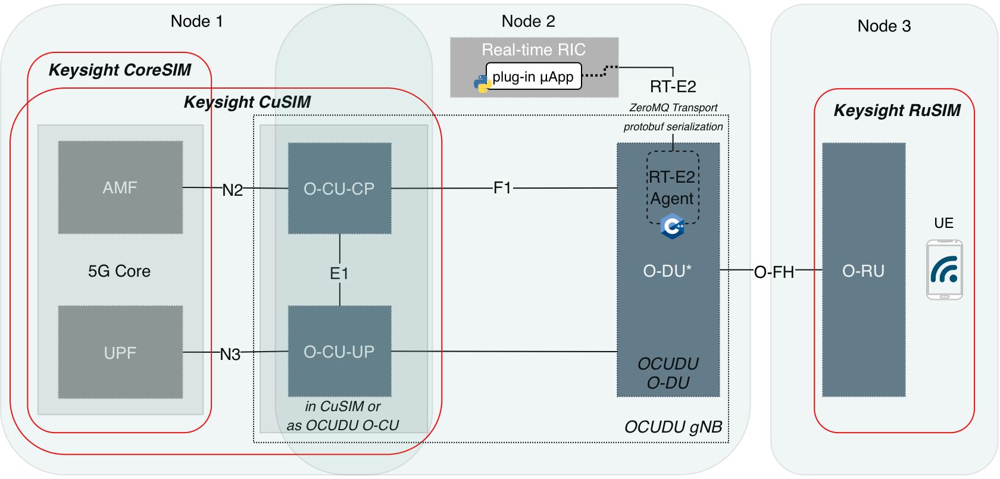

# srsRAN Project - EdgeRIC RT-E2 fork

This fork is based on [srsRAN Project](https://github.com/srsran/srsRAN_Project)
25.04.0. Since [release 24.10](https://docs.ocudu.org/releases/release_notes/#2410),
srsRAN Project supports CU/DU split, native RAN slicing, and compile-time
Split 7/Split 8 selection. This fork adapts per-UE telemetry and control from
UCSD WCSNG's
[EdgeRIC-on-5G](https://github.com/ucsdwcsng/EdgeRIC-on-5G) and extends the
EdgeRIC design [[2]](#reference-2) with inter-slice telemetry and control on
those native slicing abstractions. General documentation is linked under
[srsRAN Project resources](#srsran-project-resources).

## Deployment context



The figure shows the Keysight Open RAN Architect (KORA) Split 7.2 setup. Its
O-DU and O-RU are distinct logical functions connected over O-RAN Open
Fronthaul, and Keysight RuSIM provides the O-RU and UE side. The complementary
UvA/SNE setup uses Split 8: the PHY remains in the OCUDU/srsRAN gNB, while an
Ettus Research USRP N310 provides the RF front end through UHD; srsUE with a
USRP B210 provides the UE side.

In either setup, the 5G core may be Keysight CoreSIM, part of a Keysight CuSIM
deployment, or another compatible implementation. The CU may be supplied by
CuSIM or OCUDU/srsRAN; the OCUDU/srsRAN CU and DU can run separately over F1 or
together in one gNB process. The EdgeRIC RT-E2 agent remains with the DU
scheduler.

## Setup

Run one profile from the repository root. Supported package-manager targets are
Ubuntu 24.04 LTS and Debian 12/13.

### Split-7.2 with DPDK

This DPDK build was validated on the Keysight Open RAN Architect (KORA)
testbed used in [[1]](#reference-1). It uses the bundled FNS
configuration:

```bash
./scripts/install_system_deps.sh --with-dpdk
./scripts/setup_edgeric_venv.sh
./build-srs-gnb-er.sh --clean --dpdk
```

### UHD / Split-8

Use this profile for a UHD radio such as a USRP N310; DPDK is not needed:

```bash
./scripts/install_system_deps.sh --with-uhd
./scripts/setup_edgeric_venv.sh
./build-srs-gnb-er.sh --clean --uhd
```

Both profiles write `build/apps/gnb/gnb`. Use
`./scripts/install_system_deps.sh --dry-run` to see the exact apt actions.
System packages remain installed if the clone is removed; the build tree,
virtual environments, and generated bindings stay inside the clone.

### Critical software versions

- **Protobuf:** The schemas are standard proto3; Python generation requires
  `protoc >=3.20`. The known-good pairing is native `protoc`, C++ headers,
  and `libprotobuf` 3.21.12 with Python `protobuf==6.33.6`. Every native
  component must have the exact same version and installation prefix. The
  Python runtime may be newer than the generator, but never older.
- **ZeroMQ:** The source requires `libzmq >=4.0` and `cppzmq >=4.7`; all
  supported distro packages satisfy this. Python uses `pyzmq==27.1.0` (import
  name `zmq`). Native and Python versions need not match across the IPC boundary.
- **Python:** The base EdgeRIC environment supports Python 3.10–3.13.
  NumPy is pinned to 1.23.5 on 3.10/3.11, 1.26.4 on 3.12, and 2.2.6 on 3.13.
  The included RL muApps require Python 3.10 or 3.11.
- **Native build:** CMake 3.14+, a C++17 compiler, and FFTW 3.0+ are required.
  mbedTLS, yaml-cpp, and SCTP use supported-distro packages without extra pins.
- **Radio backends:** DPDK 22.11+ is required only with `--dpdk`. UHD uses the
  supported-distro version with `--uhd`; firmware compatibility is device-specific.

The installer and `edgeric-v2/requirements/` files are authoritative. Custom
installations must pass the Protobuf check below. No external ROHC library is
required.

### Compatibility safety gates

Do not compile yet. Record the detected host first:

```bash
cat /etc/os-release
uname -m
python3 -VV
```

Before compiling:

- **OS:** Review the installer, confirm every required and selected optional apt
  package exists, add only the exact `ID:VERSION_ID` to its allowlist, and run
  `./scripts/install_system_deps.sh --dry-run`.
- **Python:** Select an installed supported interpreter with `--python PATH`.
  Extend support only after the pinned wheels, generated Protobuf bindings, and
  smoke test pass.

Then rerun setup and perform the clean build for the chosen profile. The
included RL muApp Python limit is a known compatibility constraint.

## Running

### Split-7.2 / DPDK

The default `configs/fns_4x4_100mhz_slicing.yaml` is site-specific. Review its
AMF/bind addresses, DPDK lcores and PCI device, RU/DU MAC addresses, VLANs,
cell, and slice settings. Configure hugepages, IOMMU/VFIO, NIC binding, CPU
isolation, and device permissions for the host, then run:

```bash
./start_fns_gnb.sh
```

### UHD

Keep deployment-specific UHD profiles outside the public repository. The tracked
`configs/gnb_rf_n310_fdd_n3_20mhz.yml` is a generic 20 MHz example, not the
profile used for the captured run. Use it as a reference when creating a
deployment-specific profile.

Review the AMF and bind addresses, N310 address and device arguments, clock and
time sources, gains, band, channel bandwidth, PLMN, TAC, and slice settings.
Then pass the deployment-specific profile explicitly:

```bash
./start_fns_gnb.sh /path/to/site-specific-n310.yml
```

For a terminal-by-terminal walkthrough with representative output, see the
[N310 and EdgeRIC demo](edgeric-v2/N310_EDGERIC_DEMO.md).

The launcher starts `build/apps/gnb/gnb` as a transient root systemd service
and makes its IPC files group-writable for the invoking user's primary group.
Run EdgeRIC and muApp Python processes as an unprivileged user. Set `GNB_GROUP`
to another group only when the invoking user is already a member of it.

In another terminal, activate the base environment:

```bash
source .venv/bin/activate
```

Then run either the per-UE bitrate monitor:

```bash
python edgeric-v2/muApp3/muApp3_bitrate_monitor.py
```

or the inter-slice telemetry monitor:

```bash
python edgeric-v2/muApp4/slice_metrics.py
```

Both monitors are blocking; use separate activated terminals to run them at the
same time.

The SLA-aware slice-budget controller and its operating instructions are
documented in [the muApp5 README](edgeric-v2/muApp5/README.md).

Stop the gNB service from another terminal and verify that it is inactive:

```bash
sudo systemctl stop gnb.service
systemctl is-active gnb.service  # expect: inactive
```

`Ctrl-C` in the attached gNB terminal may stop the process or may only detach
from the service; always verify its state with `systemctl is-active`.
Only one slice-budget publisher may bind `ipc:///tmp/control_slice_budgets` at
a time. The gNB retains the last received slice-budget policy after that
publisher exits, so restart the gNB before a subsequent baseline run to restore
the YAML-configured budgets instead of reusing the cached dynamic policy.

Optional setup and compatibility notes for the included EdgeRIC per-UE muApps
are documented in
[edgeric-v2/README.md](edgeric-v2/README.md#included-edgeric-muapps-optional).

## RT-E2 telemetry and control (EdgeRIC integration)

Here, **RT-E2** means the local ZeroMQ PUB/SUB IPC interface between the gNB and
EdgeRIC/muApps; it is separate from the native O-RAN E2AP subsystem.

- Per-UE telemetry (`ipc:///tmp/metrics`, message `Metrics`) is published after
  UE scheduling at the end of each TTI. `Metrics` carries `tti_cnt`; each
  repeated `UeMetrics` carries `rnti`, `cqi`, `snr`, `tx_bytes`, `rx_bytes`,
  `dl_buffer`, `ul_buffer`, `dl_tbs`, and `slice_id`.
- Per-slice telemetry (`ipc:///tmp/slice_metrics`, message `SliceMetrics`) is
  published each TTI after intra-slice scheduling. `SliceMetrics` carries `tti`;
  each slice carries `slice_id`, current `cfg_min_prb`, `cfg_max_prb`,
  `cfg_priority`, `dl_rbs_used`, `ul_rbs_used`, `avg_dl_rbs_per_slot`,
  `avg_ul_rbs_per_slot`, and `hol_slots` (maximum DL head-of-line age in slots).
- Per-UE control (`ipc:///tmp/control_weights_actions` and
  `ipc:///tmp/control_mcs_actions`) uses non-blocking subscribers to read
  scheduling weights and MCS overrides keyed by RNTI before scheduling.
- Per-slice control (`ipc:///tmp/control_slice_budgets`) uses a non-blocking
  subscriber to read `SliceBudgets` (`min_prb`, `max_prb`, and `priority` per
  slice) at the start of inter-slice `slot_indication`.

The five hand-authored schemas in `lib/protobufs/` are the source of truth.
CMake generates disposable C++ bindings in `build/lib/edgeric/`; the Python
setup generates disposable `*_pb2.py` files in `edgeric-v2/protobufs/`.
Historical schemas in `edgeric-v2/protobufs/original/` are archives, not
generation inputs. Generated bindings are intentionally ignored because their
generator and runtime must be selected together on each host.

### Checks and cleanup

| Task | Command |
|---|---|
| Diagnose native and Python Protobuf versions | `./scripts/check_protobuf_toolchain.sh --python .venv/bin/python` |
| Regenerate Python bindings and smoke-test | `./scripts/setup_edgeric_venv.sh --generate-only` |
| Repeat only the Python import smoke test | `./scripts/setup_edgeric_venv.sh --smoke-only` |
| Rebuild cleanly with DPDK | `./build-srs-gnb-er.sh --clean --dpdk` |
| Remove the verified build directory | `./build-srs-gnb-er.sh --clean-only` |
| Remove the verified base venv | `./scripts/setup_edgeric_venv.sh --clean` |

Native gNB builds validate only the native Protobuf toolchain. Python runtime
compatibility is checked explicitly by the Python setup and generation
commands.

## References

<a id="reference-1"></a>**[1]** Asim Zoulkarni, Chrysa Papagianni, George
Iosifidis, Haoxin Sun, Francisco J. Garcia, and John S. Baras. “SLA-Aware RAN
Slicing via Online Meta-Learning.” In *2026 IEEE International Mediterranean
Conference on Communications and Networking (MeditCom)*, Cagliari, Italy, 2026,
pp. 1–6. doi: [10.1109/MeditCom67211.2026.11641095](https://doi.org/10.1109/MeditCom67211.2026.11641095).

<a id="reference-2"></a>**[2]** Woo-Hyun Ko, Ushasi Ghosh, Ujwal Dinesha,
Raini Wu, Srinivas Shakkottai, and Dinesh Bharadia. “EdgeRIC: Empowering
Real-time Intelligent Optimization and Control in NextG Cellular Networks.” In
*21st USENIX Symposium on Networked Systems Design and Implementation (NSDI
24)*, Santa Clara, CA, April 2024, pp. 1315–1330. USENIX Association. ISBN
978-1-939133-39-7. [USENIX paper](https://www.usenix.org/conference/nsdi24/presentation/ko).

---

## srsRAN Project resources

For general srsRAN Project background, dependencies, builds, and deployments:

- [srsRAN Project repository](https://github.com/srsran/srsRAN_Project)
- [Installation and build dependencies](https://docs.srsran.com/projects/project/en/latest/user_manuals/source/installation.html)
- [Running srsRAN Project](https://docs.srsran.com/projects/project/en/latest/user_manuals/source/running.html)
- [DPDK tutorial](https://docs.srsran.com/projects/project/en/latest/tutorials/source/dpdk/source/index.html)
- [Features and roadmap](https://docs.srsran.com/projects/project/en/latest/general/source/2_features_and_roadmap.html)
- [Community discussions](https://github.com/srsran/srsRAN_Project/discussions)

These resources describe the base srsRAN Project. Use the setup and running
commands above for this EdgeRIC fork.
