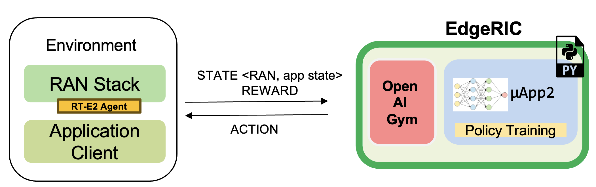

## Deployment context


The figure shows the KORA Split 7.2 setup around the EdgeRIC RT-E2 interface.
The 5G core may come from Keysight CoreSIM, a Keysight CuSIM deployment, or
another compatible implementation; the CU may be supplied by CuSIM or
OCUDU/srsRAN. OCUDU/srsRAN can run its CU and DU separately over F1 or together
in one gNB process. In Split 7.2, the O-DU and O-RU are distinct logical
functions joined by O-RAN Open Fronthaul, with Keysight RuSIM providing the
O-RU and UE side. The UvA/SNE testbed instead uses Split 8: the PHY stays in
the gNB and an Ettus Research USRP N310 provides its RF front end through UHD.
The N310 is an SDR in this split, not the Split 7.2 O-RU shown above; srsUE with
a USRP B210 provides the UE side.

## Included EdgeRIC muApps (optional)

This repository extends the EdgeRIC-on-5G version used as its starting point
and retains its per-UE muApps as optional functionality. The gNB, inter-slice
RT-E2 extensions, and muApp5 use the base environment. The original README
follows verbatim; this preface records current setup and validation.

For the N310 radio workflow and EdgeRIC telemetry/control walkthrough, see
[N310 and EdgeRIC demo](N310_EDGERIC_DEMO.md).

### Setup

Use Python 3.10 or 3.11 (CPython) with `venv` support. Install it separately;
the scripts neither install Python nor change the host default. Redis is needed
only for muApp1 policy switching:

```bash
./scripts/install_system_deps.sh --with-redis
./scripts/setup_legacy_edgeric_venv.sh --clean
./scripts/setup_legacy_edgeric_venv.sh --python /path/to/python3.11
source .venv-edgeric-legacy/bin/activate
redis-cli PING  # expect PONG
```

The first command installs the native build dependencies, `redis-server`, and
`redis-tools` system-wide; omit it when those are already managed. Python
packages, caches, and generated bindings stay in `.venv-edgeric-legacy`.
`--clean` removes only that environment, not Python, native packages, or
Redis.

### Compatibility status

Testing with Python 3.11 confirmed Redis policy switching, the non-RL
policies in `muApp1_run_DL_scheduling.py`, `muApp1_dummy_single_ue.py`, and
`muApp3_monitor_terminal.py`.

- The bundled muApp1 RL checkpoints expect exactly two simultaneously reported
  UEs: three inputs per UE and six model inputs in total.
- Ray 2.10 is pinned because Ray 2.9 relies on a Setuptools-private path absent
  from current Setuptools; a clean-install retest is pending.
- `muApp2_train_RL_DL_scheduling.py` has not been validated in this fork. It
  assumes two UEs, writes training outputs, and cannot run beside muApp1
  because both own the scheduling-control socket.
- The graphical `muApp3_monitor.py` does not match the included messenger API
  and calls Redis `FLUSHDB` at startup. Use the terminal monitor.

The setup smoke test checks dependencies and generated Protobuf bindings; it
does not run a live muApp, load the checkpoints, or validate a RAN.

---

## Running EdgeRIC 
 
Create the repository-local environment from the repository root first. The
full muApps require CPython 3.10 or 3.11:

```bash
./scripts/setup_edgeric_venv.sh --venv .venv-muapps --python python3.11 --with-muapps
source .venv-muapps/bin/activate
```

The commands below start from the repository root unless a snippet changes
directory.

```bash
redis-server
```

### EdgeRIC messenger
```bash
edgeric_messenger
├── get_metrics_multi()      # get_metrics(): receive metrics from RAN, called by all μApps
│   ├── returns ue_data dictionary
├── send_scheduling_weight() # send the RT-E2 scheduling policy message to RAN
├── send_mcs()               # send the RT-E2 MCS policy message to RAN 
    
```
#### μApps supported in this codebase
```bash
├── /muApp1           # weight based abstraction of downlink scheduling control
│   ├── muApp1_run_DL_scheduling.py
├── /muApp2           # training an RL agent to compute downlink scheduling policy
    ├── muApp2_train_RL_DL_scheduling.py
├── /muApp3           # Monitoring the realtime metrics
    ├── muApp3_monitor.py    

```

#### To test custom scheduling and MCS control
Edit the python files to chose fixed scheduling and mcs actions  
```bash
python edgeric-v2/send_mcs.py
python edgeric-v2/send_weight.py
```

### Running muApp1 - downlink scheduler

**Weight Based abstraction of control** The scheduling logic in ``srsenb`` is updated to support a weight based abstraction to allocate the number of RBGs to allocate per UE. A weight based abstraction allows us to implement any kind of scheduling policy where we provide a weight ``w_i`` for each UE, the RAN then allocates ``[w_i*available_rbgs]`` RBGs to each UE.     

```bash
cd edgeric-v2/muApp1
redis-cli set scheduling_algorithm "Max CQI" # setting an initial scheduler
python muApp1_run_DL_scheduling.py
```
#### Setting the scheduler algorithm manually
Set the scheduling algorithm you want to run:
```bash
# Line 259
selected_algorithm = "Max CQI"   # selection can be: Max CQI, Max Weight,
                                 # Proportional Fair (PF), Round Robin 
                                 # RL - models are included for 2 UEs
```
If the algorithm selected is RL, set the directory for the RL model
```bash
# Line 270
rl_model_name = "Fully Trained Model"  # selection can be Initial Model,
                                       # Half Trained Model, Fully Trained Model - to see benefits, run UE1 with load 5Mbps, UE2 with 21Mbps
```
The respective models are saved in:
```bash
├── ../rl_model/           
    ├── initial_model 
      ├──model_demo.pt
    ├── half_trained_model 
      ├──model_demo.pt
    ├── fully_trained_model 
      ├──model_demo.pt
```
 
#### Using redis to update the scheduling algorithm

```bash
redis-cli set scheduling_algorithm "Max Weight" #selection can be: Max CQI, Max Weight,
                                                # Proportional Fair (PF), Round Robin
                                                # Single UE Priority (throttle others)
                                                # RL - models are included for 2 UEs
```

When using **Single UE Priority**, optionally pin the UE (by RNTI) that should retain the majority of the resources:

```bash
redis-cli set priority_ue_rnti 70     # decimal RNTI
redis-cli set priority_ue_rnti 0x46   # hexadecimal is OK too
# To fall back to the first detected UE simply `redis-cli del priority_ue_rnti`
```

**What to observe**  
muApp1 terminal will show the algorithms selected and will print the total average system throughput observed
```bash
Algorithm index:  2  ,  Max Weight
total system throughput: 8.781944 

Algorithm index:  2  ,  Max Weight
total system throughput: 8.063600000000001 

Algorithm index:  2  ,  Max Weight
total system throughput: 8.093352 

Algorithm index:  2  ,  Max Weight
total system throughput: 8.071168 
```
**Terminal** - To observe the throughput updates, update the scheduler with the following command 
```bash
redis-cli set scheduling_algorithm "RL" 
```

**Terminal** - Increased system throughput observed with our trained RL model
```bash
Algorithm index:  20  ,  RL
Executing RL model at: ./rl_model/fully_trained_model
total system throughput: 12.071200000000001 

Algorithm index:  20  ,  RL
Executing RL model at: ./rl_model/fully_trained_model
total system throughput: 11.727624 

Algorithm index:  20  ,  RL
Executing RL model at: ./rl_model/fully_trained_model
total system throughput: 11.714879999999999 

Algorithm index:  20  ,  RL
Executing RL model at: ./rl_model/fully_trained_model
total system throughput: 11.710384 

Algorithm index:  20  ,  RL
Executing RL model at: ./rl_model/fully_trained_model
total system throughput: 11.743776 
```

#### Running muApp3 - Monitoring
This muApp will help us see the RT-E2 Report Message from the RAN and the RT-E2 Policy message sent to RAN  

```bash
cd edgeric-v2/muApp3
python muApp3_monitor_terminal.py
```
**What to observe**  
```bash
RT-E2 Report: 

RAN Index: 791000, RIC index: 790998 

UE Dictionary: {70: {'CQI': 7, 'SNR': 115.46858215332031, 'Backlog': 384977, 'Pending Data': 0, 'Tx_brate': 1980.0, 'Rx_brate': 0.0}, 71: {'CQI': 8, 'SNR': 116.41766357421875, 'Backlog': 1503, 'Pending Data': 0, 'Tx_brate': 0.0, 'Rx_brate': 0.0}} 

RT-E2 Policy (Scheduling): 
Sent to RAN: ran_index: 790999
weights: 70.0
weights: -0.15028022229671478
weights: 71.0
weights: 1.150280237197876
```

#### Running muApp2 - Training an RL policy for scheduling



We are training a PPO agent with the objective of throughput maximization in this particular study.

##### Usage

```bash
cd edgeric-v2/muApp2
python muApp2_train_RL_DL_scheduling.py # --config-name=edge_ric
```

##### muApp2_train_RL_DL_scheduling.py

* Trains PPO agent for ```num_iters``` number of iterations
    * One iteration consists of training on 2048 samples and evaluating for 2048 timesteps
    * The evaluation metric (avg reward per episode) is plotted as the training graph
    * ``outputs/`` folder will save the training log, ``eval_R_avg`` is the metric plotted to visualize the training


##### Repo Structure
```bash

├── conf
│   ├── edge_ric.yaml   # Config file for edgeric RL training
│   ├── example.yaml
│   ├── simpler_streaming.yaml
│   └── single_agent.yaml
├── outputs # Output logs of each training sorted chronologically
│   ├── 2022-10-07
         ├── model_best.pt # Saved policy neural network weights
│          .
│          .
│          .
│          
└── ../stream_rl # Name of the python package implementing the simulator mechanisms
    ├── callbacks.py
    ├── envs # All the envs
    │   ├── cqi_traces
    │   │   ├── data.csv # CQI trace to be used by simulation env
    │   │   └── trace_generator.py # Code to generate synthetic CQI traces
    │   ├── edge_ric.py # Our Env 
    │   ├── simpler_streaming_env.py
    │   ├── single_agent_env.py
    │   └── streaming_env.py
    │   └── __init__.py
    ├── __init__.py
    ├── plots.py # All plotting code
    ├── policy_net # Custom policy net architectures (not currently used)
    │   ├── conv_policy.py
    │   ├── __init__.py
    ├── registry # Registry system for registering envs and rewards (to keep things modular)
    │   └── __init__.py
    └── rewards.py # Definition of reward functions to be used in envs
```
Once the training completes: take the model_best.pt and save in the ../rl_model folder

##### EdgeRIC Env (edge_ric.py)

```
                    CQI1          BL1
                ┌────────────┬─┬─┬─┬─┐
Bernoulli  ───► │            │ │ │ │ │ ──►   f(CQI1, BL1) = allocated_RBG1/ Total
                │            │ │ │ │ │
                └────────────┴─┴─┴─┴─┘
                    CQI2          BL2
                ┌────────────────┬─┬─┐
Bernoulli  ───► │                │ │ │ ──►   f(CQI2, BL2) = allocated_RBG2/ Total
                │                │ │ │
                └────────────────┴─┴─┘
                          .
                          .
                          .
                          . num_UEs
                          .
                          .
                          .
                ┌────────────┬─┬─┬─┬─┐
Bernoulli  ───► │            │ │ │ │ │ ──►   f(CQI_{N}, BL_{N}) = allocated_RBG_{N}/ Total
                │            │ │ │ │ │
                └────────────┴─┴─┴─┴─┘
```


* State_space : ```[BL1,CQI1,BL2,CQI2.....]``` (if augmented_state_space=False)
* Action_space : ```[Weight1,Weight2.....]```
* Parameters of the env configurable in ```"./conf/edge_ric.yml"```, under ```env_config``` field
